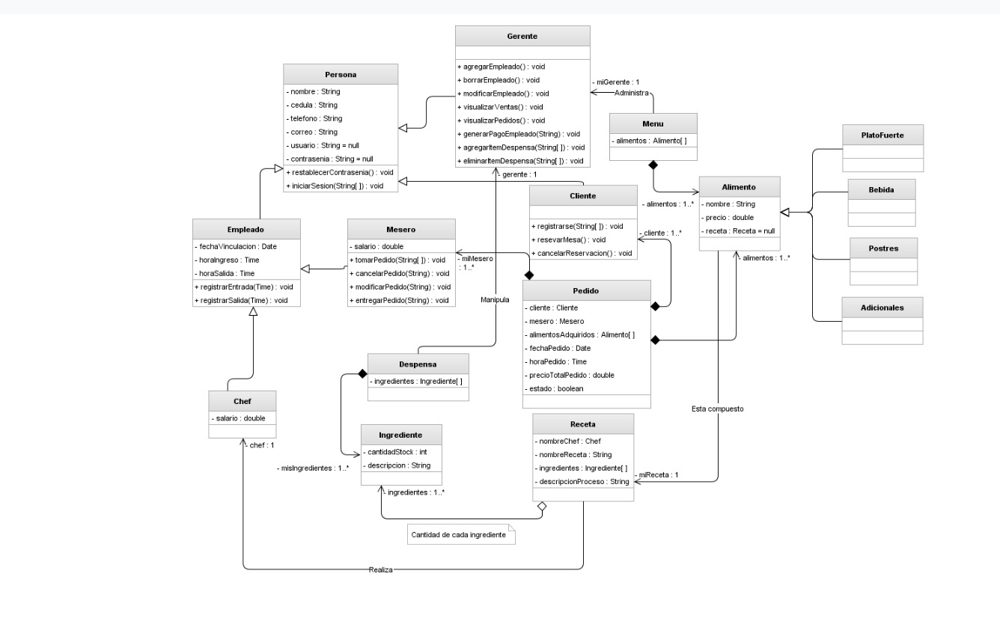

# MenuJPA — Sistema de Gestión de Menú

<p align="center">
  
  
  
  
  
  
  
  
  
  
</p>

Sistema web para la gestión gastronómica de un restaurante. Permite administrar menús, recetas, alimentos, chefs, meseros, gerentes, clientes, pedidos y despensa a través de una interfaz web.



---

## Stack

| Capa | Tecnología |
|---|---|
| Backend | Java 17 · Spring Boot 3.2.5 · Spring Data JPA · Hibernate |
| Base de datos | MySQL 8 |
| Auth | Spring Security · JWT (jjwt) · BCrypt |
| Documentación API | springdoc-openapi (Swagger UI) |
| Frontend | Thymeleaf · Vanilla CSS · Vanilla JS |
| Testing | JUnit 5 · Mockito |
| Build | Maven |

---

## Módulos

### Gestión
- **Menús** — Creación y gestión de menús con asignación de gerente y recetas
- **Recetas** — Recetas con dificultad, tiempo de preparación y lista de alimentos
- **Alimentos** — Catálogo con tipos: Plato Fuerte, Bebida, Postre, Adicional

### Personal
- **Chefs** — Personal de cocina con especialidad, experiencia y horarios
- **Meseros** — Personal de sala que toma y entrega los pedidos
- **Gerentes** — Responsables de menús y despensa

### Operaciones
- **Clientes** — Registro de clientes con usuario y contraseña
- **Ingredientes** — Stock de ingredientes con descripción y cantidad
- **Despensas** — Agrupan el stock de ingredientes, administradas por un gerente
- **Pedidos** — Ciclo de vida completo: tomar, modificar, entregar, cancelar, con cálculo de precio total
- **Pagos** — Nómina de Chefs/Meseros generada por el gerente (monto = salario)
- **Mesas** — Mesas del salón (número y capacidad)
- **Reservas** — Reserva de mesas por los clientes, con validación de capacidad y de solapamiento de horarios

---

## Arquitectura

```
MenuJpaApplication
├── controllers/    BaseControllerImpl<E, S>  → endpoints REST
├── services/       BaseServiceImpl<E>        → lógica de negocio
├── repositories/   BaseRepository<E>        → Spring Data JPA
└── entities/       jerarquía de clases del dominio
```

### Jerarquía de entidades

```
Base
└── Persona
    ├── Empleado (abstracto)
    │   ├── Chef
    │   └── Mesero
    ├── Gerente
    └── Cliente

Base
├── Alimento (SINGLE_TABLE)
│   ├── PlatoFuerte
│   ├── Bebida
│   ├── Postre
│   └── Adicional
├── Menu
├── Receta
├── Ingrediente
├── Despensa
├── Pedido
├── Pago
├── Mesa
└── Reserva
```

### Jerarquía de services (espeja la de entidades)

```
BaseServiceImpl<E, ID>
└── PersonaServiceImpl<E, ID>       (hashea/preserva la contraseña)
    ├── ClienteServiceImpl
    ├── GerenteServiceImpl
    └── EmpleadoServiceImpl<E, ID>  (fichaje: registrarEntrada/registrarSalida)
        ├── ChefServiceImpl
        └── MeseroServiceImpl
```

---

## Requisitos

- Java 17+
- MySQL 8 corriendo en `localhost:3306`
- Maven 3.8+

---

## Configuración

**1. Crear la base de datos:**

```sql
CREATE DATABASE menujpa CHARACTER SET utf8mb4 COLLATE utf8mb4_unicode_ci;
```

**2. Editar credenciales** en `src/main/resources/application.properties`:

```properties
spring.datasource.username=tu_usuario
spring.datasource.password=tu_contraseña
```

**3. Configurar el secreto JWT:** copiar `.env.example` a `.env` (o exportar las variables directamente) y completar `JWT_SECRET` con una cadena aleatoria de al menos 32 caracteres. La app **no arranca** sin esta variable — no hay valor por defecto a propósito.

```bash
cp .env.example .env
# editar .env y completar JWT_SECRET
export $(grep -v '^#' .env | xargs)   # o configurar las variables en tu IDE
```

---

## Ejecución

```bash
# Compilar y correr con hot-reload
./mvnw spring-boot:run

# Build completo
./mvnw package -DskipTests
```

La aplicación queda disponible en `http://localhost:8080`.

La documentación interactiva de la API (Swagger UI) queda disponible en `http://localhost:8080/swagger-ui/index.html`.

---

## Endpoints REST

| Entidad | Base URL | CRUD genérico |
|---|---|---|
| Menús | `/api/v1/menus` | sí |
| Recetas | `/api/v1/recetas` | sí |
| Alimentos | `/api/v1/alimentos` | sí |
| Chefs | `/api/v1/chefs` | sí |
| Meseros | `/api/v1/meseros` | sí |
| Gerentes | `/api/v1/gerentes` | sí |
| Clientes | `/api/v1/clientes` | sí |
| Ingredientes | `/api/v1/ingredientes` | sí |
| Despensas | `/api/v1/despensas` | sí |
| Mesas | `/api/v1/mesas` | sí |
| Pedidos | `/api/v1/pedidos` | **no** — solo `GET`, alta/baja/edición vía acciones (ver abajo) |
| Pagos | `/api/v1/pagos` | **no** — solo `GET`, alta vía `POST /generar` |
| Reservas | `/api/v1/reservas` | **no** — solo `GET`, alta/baja vía `reservar`/`cancelar` |

Las entidades con CRUD genérico soportan: `GET /`, `GET /{id}`, `POST /`, `PUT /{id}`, `DELETE /{id}`. `Pedido`/`Pago`/`Reserva` lo dejan afuera a propósito: sus altas y bajas dependen de reglas de negocio (cálculo de precio, guardas de estado, validación de horarios) que un `POST`/`PUT` genérico esquivaría.

---

## Autenticación

JWT stateless. Pueden loguearse los 4 roles con `usuario`/`contrasenia` (heredados de `Persona`): `Cliente`, `Chef`, `Mesero` y `Gerente`. No hay una tabla `Usuario` genérica — el login busca las credenciales en las 4 tablas de dominio.

| Endpoint | Descripción |
|---|---|
| `POST /api/v1/auth/registrarse` | Alta pública de un `Cliente` nuevo. Devuelve el JWT. |
| `POST /api/v1/auth/login` | Login de cualquiera de los 4 roles. Devuelve `{ "token": "...", "rol": "..." }`. |

Los tokens van en el header `Authorization: Bearer <token>`.

**Reglas de autorización:**

| Método | Recurso | Quién puede |
|---|---|---|
| `GET` | cualquiera | público |
| `POST /chefs/fichar/**` | fichaje propio | solo `CHEF` |
| `POST /meseros/fichar/**` | fichaje propio | solo `MESERO` |
| `POST` / `PUT` / `DELETE` | `/chefs`, `/meseros`, `/gerentes`, `/despensas`, `/ingredientes`, `/mesas`, `/pagos` | solo `GERENTE` |
| `/pedidos/tomar`, `/modificar`, `/entregar`, `/cancelar` | ciclo de vida del pedido | `MESERO` o `GERENTE` |
| `POST /reservas/reservar` | reservar una mesa | solo `CLIENTE` |
| `POST /reservas/{id}/cancelar` | cancelar una reserva | el `CLIENTE` dueño, o cualquier `GERENTE` |
| `POST` / `PUT` / `DELETE` | el resto (`/menus`, `/recetas`, `/alimentos`, `/clientes`) | cualquier rol autenticado |

> No hay alta pública de `Gerente`/`Chef`/`Mesero` — el primer gerente hay que sembrarlo a mano en la base (problema clásico de bootstrap de un rol admin). Los siguientes gerentes pueden crear personal vía `POST /api/v1/gerentes` una vez logueados.


## Endpoints adicionales

```
POST   /api/v1/menus/{menuId}/recetas/{recetaId}          → agregar receta al menú
DELETE /api/v1/menus/{menuId}/recetas/{recetaId}          → quitar receta del menú

POST   /api/v1/despensas/{despensaId}/ingredientes/{id}   → agregar ingrediente a la despensa
DELETE /api/v1/despensas/{despensaId}/ingredientes/{id}   → quitar ingrediente de la despensa

POST   /api/v1/chefs/fichar/entrada                       → fichar entrada (chef autenticado)
POST   /api/v1/chefs/fichar/salida                        → fichar salida (chef autenticado)
POST   /api/v1/meseros/fichar/entrada                     → fichar entrada (mesero autenticado)
POST   /api/v1/meseros/fichar/salida                      → fichar salida (mesero autenticado)

POST   /api/v1/pedidos/tomar                               → tomar un pedido nuevo (mesero autenticado)
PUT    /api/v1/pedidos/{id}/modificar                       → reemplazar alimentos y recalcular el total
POST   /api/v1/pedidos/{id}/entregar                        → marcar como entregado
POST   /api/v1/pedidos/{id}/cancelar                        → cancelar (borra si no fue entregado)

POST   /api/v1/pagos/generar                                → generar el pago de un Chef o Mesero

POST   /api/v1/reservas/reservar                            → reservar una mesa (cliente autenticado)
POST   /api/v1/reservas/{id}/cancelar                       → cancelar una reserva propia (o cualquiera, si sos gerente)
```

---

## Tests

Cobertura unitaria de la capa de `services` con JUnit 5 + Mockito: CRUD genérico heredado de `BaseServiceImpl` y las reglas de negocio propias de cada servicio (validaciones de borrado, alta/baja en relaciones N a N). Los repositorios se mockean, así que la suite no depende de una base de datos real ni de que la app esté corriendo.

```bash
# Correr toda la suite
./mvnw test

# Correr una clase de test puntual
./mvnw test -Dtest=MenuServiceImplTest
```

---

## Estructura del proyecto

```
menujpa-spring/
├── src/
│   ├── main/
│   │   ├── java/com/menujpa/
│   │   │   ├── MenuJpaApplication.java
│   │   │   ├── config/         OpenApiConfig.java, SecurityConfig.java
│   │   │   ├── security/       JwtService, JwtAuthenticationFilter, MultiRoleUserDetailsService, PasswordHasher
│   │   │   ├── dto/            requests de auth, pedidos, pagos y reservas
│   │   │   ├── controllers/
│   │   │   ├── services/
│   │   │   ├── repositories/
│   │   │   └── entities/
│   │   └── resources/
│   │       ├── application.properties
│   │       ├── static/
│   │       │   ├── css/style.css
│   │       │   └── js/api.js
│   │       └── templates/
│   │           ├── index.html
│   │           ├── menus.html
│   │           ├── recetas.html
│   │           ├── alimentos.html
│   │           ├── chefs.html
│   │           └── gerentes.html
│   └── test/java/com/menujpa/
│       ├── SmokeTest.java
│       ├── security/    PasswordHasherTest, JwtServiceTest
│       └── services/    un *ServiceImplTest.java por servicio
├── docs/
│   └── DiagramaMenu.jpeg
├── .env.example
├── mvnw / mvnw.cmd
└── pom.xml
```

---

## Validaciones

El sistema aplica validaciones en dos capas:

- **Backend (Jakarta Validation):** `@NotBlank`, `@Size`, `@Email`, `@DecimalMin`, `@Past`, `@Pattern` en las entidades. Los errores se devuelven como JSON con mensaje descriptivo.
- **Frontend (JavaScript):** validaciones antes de enviar cada formulario con mensajes toast.

> El frontend (Thymeleaf) hoy solo cubre Menús, Recetas, Alimentos, Chefs y Gerentes — Clientes, Ingredientes, Despensas, Pedidos, Pagos, Mesas y Reservas todavía no tienen página propia. La API sí los expone completos; falta la UI.

---

## Notas

- Las tablas se crean/actualizan automáticamente con `spring.jpa.hibernate.ddl-auto=update`.
- La herencia de `Alimento` usa `SINGLE_TABLE` con discriminador `tipo_alimento`.
- `Empleado` es una clase abstracta (`@MappedSuperclass`) que centraliza los campos comunes de `Chef` y `Mesero`.
- `usuario`/`contraseña` viven en `Persona`, así que los 4 roles (`Cliente`, `Chef`, `Mesero`, `Gerente`) comparten el mismo mecanismo de login.

---

## Autor

    Martin Emanuel Zamora
    Instituto Tecnologico Universitario (ITU) — 2026
